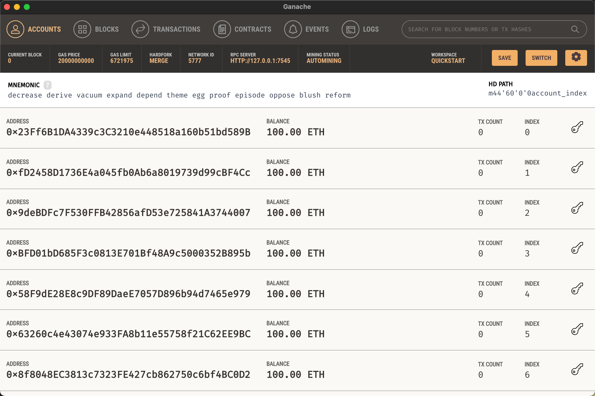

# Test_Dapp

该项目是一个个人Solidity项目，旨在通过简约的方式开发一款去中心化的应用 (Dapp)。项目参考了市面上现有的Dapp进行设计与开发。

### 使用的技术

- **项目构建**: 使用Vite快速搭建项目结构，以提高开发效率。
- **前端布局**: 利用Tailwind CSS框架进行静态页面布局和H5响应式设计，确保应用在不同设备上的良好体验。
- **智能合约**: 采用Hardhat工具进行Solidity智能合约的编写、测试，并部署至本地Ganache测试网络。
- **钱包集成**: 通过Ethers.js库实现在前端与用户的钱包（如MetaMask）之间的交互，方便用户与智能合约进行交互。
- **数据交互**: 使用智能合约的ABI文件来实现前端与后端智能合约的数据交互。

### 主要职责

- **项目初始化**: 从零开始构建整个项目，包括需求分析、架构设计和技术选型。
- **智能合约开发**: 使用Solidity编写智能合约，确保合约的安全性和功能性。
- **本地部署**: 利用Hardhat将智能合约部署到本地的Ganache测试网络上，便于调试和测试。
- **前端集成**: 开发前端界面并与智能合约进行集成，允许用户通过浏览器钱包（如MetaMask）与Dapp交互。
- **测试与优化**: 对项目进行全面测试，包括单元测试、集成测试等，确保应用的稳定性和用户体验。

### 遇到的挑战与解决方案

- **智能合约安全**: 在开发智能合约的过程中，重点关注安全性问题，例如防止重入攻击等常见漏洞。
- **前端兼容性**: 确保前端页面在不同浏览器和设备上的兼容性，利用Tailwind CSS的响应式设计特性解决这一问题。
- **用户钱包集成**: 解决用户钱包（如MetaMask）与Dapp之间的连接问题，确保用户能够顺利地进行交易操作。

通过以上步骤，该项目成功地实现了从概念到实际运行的全过程，为用户提供了一个简单易用且安全可靠的Dapp平台。


## 目录说明

```
├── hardhat_web3 # hardhat工具
├── web3_wallet # 构写web3前端页面
├────src #主目录
│			├─utils #公共配置文件
│			|		├─constants #合约配置

```


## 本地配置

安装Ganache，使用里面生成的账户


